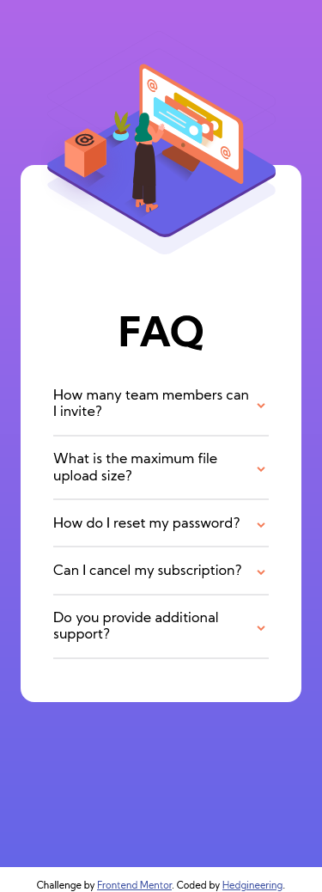
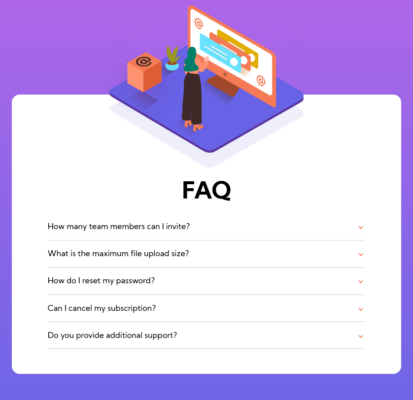
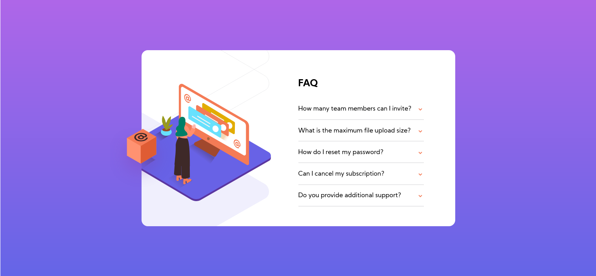

# Frontend Mentor - FAQ accordion card solution

This is a solution to the [FAQ accordion card challenge on Frontend Mentor](https://www.frontendmentor.io/challenges/faq-accordion-card-XlyjD0Oam). Frontend Mentor challenges help you improve your coding skills by building realistic projects.

## Overview

### The challenge

Users should be able to:

- View the optimal layout for the component depending on their device's screen size
- See hover states for all interactive elements on the page
- Hide/Show the answer to a question when the question is clicked

### Screenshot

Mobile



Tablet



Desktop



## My process

### Built with

- Semantic HTML5 markup
- CSS custom properties
- Flexbox
- CSS Grid
- Desktop-first workflow

### What I learned

The two biggest challenges for this project was efficiently selecting the relevant elements to be modified with classes from the javascript code and responsively placing the svg artwork.

Regarding the javascript selectors, I wanted to make my code efficient, so I took advantage of event bubbling and delegation to only place one event listener which would fire when anything in the faq-info region was clicked:

```js
const faqContainer = document.getElementById('faq-info-container');
let prevClickedItem = -1;
let prevClickedArrow = -1;

faqContainer.addEventListener('click', (e) => {
	try {
		const clickedItem = e.target.closest('.faq-item');

		// Since I'm querying the clicked faq-item only,
		//  it'll find the arrow from within its children specifically.
		const clickedArrow = clickedItem.querySelector('.arrow');

		if (prevClickedItem === -1) {
			prevClickedItem = clickedItem;
			prevClickedArrow = clickedArrow;
		} else {
			prevClickedItem.classList.remove('open');
			prevClickedItem.classList.add('closed');
			prevClickedItem = clickedItem;

			prevClickedArrow.classList.remove('up');
			prevClickedArrow.classList.add('down');
			prevClickedArrow = clickedArrow;
		}

		clickedItem.classList.remove('closed');
		clickedItem.classList.add('open');

		clickedArrow.classList.remove('down');
		clickedArrow.classList.add('up');
	} catch (error) {
		console.log(error);
	}
});
```

Here, I created a pure anonymous function (one that only depended on the event passed into it) which would identify which faq question was targeted and which elements within needed to be modified, then would go ahead and assign relevant css classes to cause the necessary visual updates on screen.

With the artwork, I had to use a combination of absolute/relative positioning, with transforms, and relative scales and media queries to make the artwork behave in a desirable manner. You can take a look at my CSS file for more details, as this process was rather trial-and-error based.

### Continued development

I want to continue learning more about writing efficient, clean javascript code and better CSS animation, positioning, and modularity principles for better code in the future.

### Useful resources

- [The Net Ninja JS DOM Playlist](https://www.youtube.com/playlist?list=PL4cUxeGkcC9gfoKa5la9dsdCNpuey2s-V) - This helped me learn the basics of DOM manipulaiton with JS, and I am excited to use the techniques it taught me in future projects.

## Author: Rahul Hegde

- Frontend Mentor - [@Hedgineering](https://www.frontendmentor.io/profile/Hedgineering)
